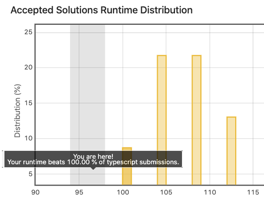

未来的 Yulei：

Hi，现在是 2021 年的第一个月，这是我写给你的第一封信，是对我来说迈出的很重要的一步。

受到 B 站 up 主张子贺的影响，我决定像他一样每个月给未来的我（也就是你）写一封信，记录你一路成长的心路历程。通过这种方式，也可以激励和督促我进步。张子贺今年 27 岁，他说他坚持了 5 年，所以我现在开始也不晚。

前段时间看到了一句话——人一定会退步，如果没有努力，那这个世界上能和你一起自然增长的应该只剩下各种痛苦。很长一段时间，我一直秉持「努力无用」的想法，因为觉得「需要刻意努力的事情一定不是你的热爱」、「你对热爱的事情的投入不叫努力」，但现在我觉得我错了，生活本身不是容易的事情，如果做不到热爱生活的方方面面（也不太可能），那就只能为生活做出努力。良好的作息、运动的习惯、知识的增长，都需要「努力」去达成，逃避或停滞不前的后果就是随年龄一起增长的各种痛苦。

大概是在 1 月中旬的时候我删掉了微博、B 站这两个让我很上瘾的应用，导致的结果是，我错过了 1 月份的两个大瓜，想必也错过了一些及时资讯和梗，互联网变化得很快。但其实，这些瓜和梗只会对我的生活造成一点点影响，甚至是没有，屏蔽它们，帮我节约了很多时间。我可以用 RSS 订阅真正想看的内容，过滤掉那些怎么也刷不完，只会浪费我们时间的 feed。

## 习惯养成：放弃早睡早起吧

过去 30 天习惯养成情况：

| 习惯                  | 次数 | 备注                                                         |
| --------------------- | ---- | ------------------------------------------------------------ |
| 8 点起床              | 1    |                                                              |
| 23 点 30 睡觉         | 4    |                                                              |
| 英语阅读 1h           | 15   | [Preparing for a Tech Talk](https://github.com/yuleicul/weekly-reading/blob/c2b605407befac3a33c54f68fb28fa8e790662ac/article/007.Preparing-for-a-Tech-Talk-Dan-Abramov.md) [30 Days After Quitting My Job](/docs/English-Learning/doc2) [The Day You Decided to Take the Leap](https://github.com/yuleicul/weekly-reading/blob/c2b605407befac3a33c54f68fb28fa8e790662ac/article/009.the-day-you-decided-to-take-the-leap.md) |
| LeetCode 1h           | 12   | 达成「beats 100% submissions」一次，如下图                   |
| 自学 1h               | 7    | NestJS 文档阅读                                              |
| 读书 > 30m            | 10   |                                                              |
| 每日手机使用时长 < 2h | 14   |                                                              |
| 运动 > 1h             | 3    |                                                              |
| 练习吉他 > 1h         | 7    |                                                              |

从下个月开始放弃早睡早起，不用强迫自己去养成某种习惯，但每天的睡眠时长最好保证在 7 小时以上。

## 读了什么？

### 《皮肤的秘密》—— [ 德 ] 耶尔 · 阿德勒   

对我产生的影响：

1. 公司每天有免费麦当劳，但看了这本书后我再也没有吃过，为了减少摄入不饱和脂肪酸，它对皮肤会造成很差的影响。
2. 过去的一个月几乎每天下午吃健康餐，一是减少精制白面的摄入，二是帮助加大蔬菜（胡萝卜、西红柿）的摄入。
3. 开始慢慢吃水果了，以前是不会刻意去吃水果的。
4. 香水、香烟、酒、纹身，如果说在看这本书之前它们对我还有一些吸引力，看完之后彻底没有了。
5. 过去三周每天只用流动的清水清洗脸部皮肤，不用任何洗面奶，皮肤状况和之前比起来明显好了很多。

### 《呼吸》—— [ 美国 ] 特德 · 姜

「无论过去还是未来，我们都无法改变，只能更深刻地去理解它们。」
给未来写信这件事，或许能让未来的我更深刻地去理解此时此刻。

「我们在消耗秩序，造成无序，我们靠增加宇宙的无序度为生。正因为宇宙诞生在一个高度有序的状态，我们才能存在。」

--- end

2021-01-31
Yulei

> If I could be wasting my time with you. (Waste - Phish)

