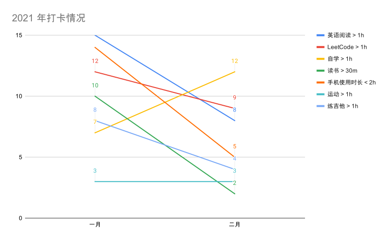

未来的 Yulei：

这是给你的第二封信。

这个月回了趟家，过年。和往年差不多，和朋友聚会，和家人打麻将，彻底地放松，什么也不用思考，闭上眼睛就能入睡，一觉醒来午饭已经做好。一切都很惬意，朋友的大笑、烤焦的鸡皮、夜晚的雨声、昏黄的街道……

有一个地方，保存了你人生很珍贵的一段时光，你想它的时候，就可以回去走走，见最想见的人，吃最想吃的东西，看最美的风景，忆儿时纯真。尽管时间一到，你不得不走，但只要想到它仍在那儿，就已经很幸福了。

## 看视频不丢人

上个月，我开始了一项计划——每月入门一项技术。起因是，当我回顾去年列出的「想学习的技术清单」 时，我发现大部分都没有完成，而且学习路线很随机，缺少一个好的学习路线会让知识没有连贯性、学起来比较困难，所以我想改变这样的情况，想好好培养自学能力，好好学习一些也许在未来排的上用场的知识。

我在上个月尝试学习的技术是 NestJS，一个框架。很多人都曾告诉我，学习一项技术最好的学习方法是去它的官网，浏览文档、指南，官网的信息往往是最新、最准确。所以我二话不说直奔 NestJS 文档，从头开始啃，第一章就啃了我两周时间，但啃完之后还是不知道怎么用。我不得不回到刚开始学前端时的学习方法，去搜索相关教学视频，结果发现，还是视频管用。

所以呢，如果你对一项技术完全不了解，想在短时间内掌握最基本的用法，我的建议是，去搜索一些优质的视频（将茫茫文档中主要的部分提取出来讲解给你听，还结合了真实的例子）来看，而不是直接啃文档。不得不承认，在某些方面视频比文字更能提起学习者的兴趣，兴趣很重要，相信当你有了足够的兴趣，就算是阅读那些难懂的文档，也不成问题。看视频不丢人，不学才丢人。

## 一个 idea

我发现自己最近对打卡、记录、习惯、番茄钟这些东西有点依赖，试了很多 App，但没有一个特别满意的，所以打算今年之内自己做一个打卡 App，flag 我就立在这了！

## 打卡情况

这个月因为休息了一段时间，打卡情况不如上月，但积累了很多能量，下月等着！！

--- end

2021/02/28
Yulei

> 为何一转眼，时光飞逝如电。（忘不了 - 童安格）

