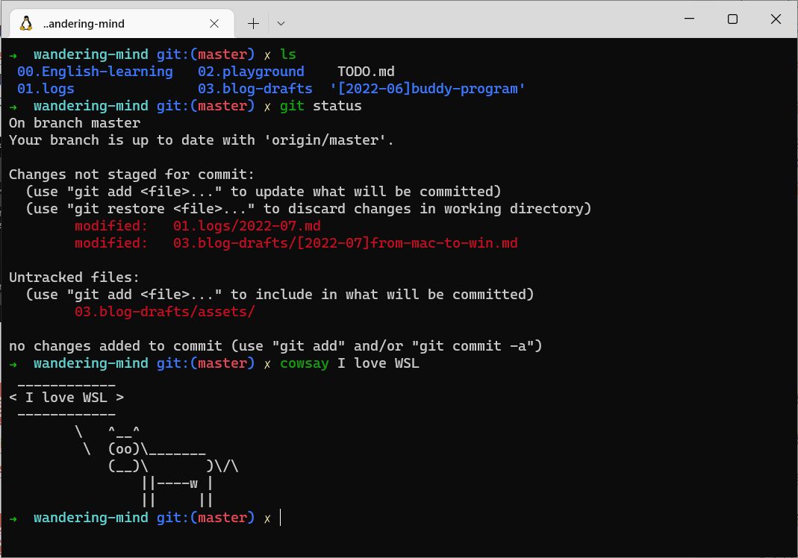

Last month I joined a new company as a software engineer. I whined when I received my new workstation, a Windows 10 laptop. I have used MacBook for 5 years, and I love the smooth interaction, Unix based operating system, long battery life (I mean in the earlier days), especially the trackpad which I bet is the greatest trackpad in the world! However, for making a living, I have to use the Windows computer for daily work. 

This post is about my transition from Mac to Windows 10. I'll introduce all the tools and methods I have tried over the last month for better adaptation. 

First of all, there are all things now I use:

- A Windows 10 laptop
- A mouse (still found no way comfortable to use the trackpad, but will tell you how to switch virtual desktops)
- WSL2 with Windows Terminal
- Right button ninjia

## WSL2

> Windows Subsystem for Linux (WSL) lets developers run a GNU/Linux environment -- including most command-line tools, utilities, and applications -- directly on Windows, unmodified, without the overhead of a traditional virtual machine or dual-boot setup. 
>
> -- [WSL Documentation](https://docs.microsoft.com/en-us/windows/wsl/)

</img>

Follow the next documents or posts step by step to get your WSL environment:

1. Know about WSL: [What is WSL](https://docs.microsoft.com/en-us/windows/wsl/about)

2. Set up your WSL environment: [Best practices for set up](https://docs.microsoft.com/en-us/windows/wsl/setup/environment), which includes some key processes you need to pay attention:
   - Installation
   - Set up Windows Terminal
   - Set up your Visual Studio Code
   - Set up Git
   - Set up Docker
   
3. Use **nvm** (Node Version Manager) to install Node.js and npm (Node Package Manager): [Install nvm, node.js, and npm](https://docs.microsoft.com/en-us/windows/dev-environment/javascript/nodejs-on-wsl#install-nvm-nodejs-and-npm)

4. Use **Antigen** to easily manage your shell (zsh) plugins: [Zsh + Antigen + Oh my Zsh = A Beautiful, Powerful, and Robust Shell](https://phuctm97.com/blog/zsh-antigen-ohmyzsh)

   > Note: many oh-my-zsh themes require installing a [Powerline Font](https://github.com/powerline/fonts) or a [Nerd Font](https://github.com/ryanoasis/nerd-fonts) in order to render properly. Without them, these themes will render [weird prompt symbols](https://github.com/ohmyzsh/ohmyzsh/wiki/FAQ#i-have-a-weird-character-in-my-prompt).
   >
   > -- [oh-my-zsh](https://github.com/ohmyzsh/ohmyzsh#selecting-a-theme)

## Right button ninjia

The touchpad in my new Windows laptop is too hard to use, but I still need the interaction between the touchpad and the computer such as three fingers swiping left or right to switch virtual desktops, swiping up to show multitasking view, swiping down to show desktop.

I found [right-button-ninjia](https://github.com/hansenwangvip/right-button-ninja/blob/master/README_EN.md) which is a mouse gesture software helping me switch virtual desktops easily.

## Windows personalization

Besides all of the wonderful applications I mentioned before, there are some Windows personalization settings making your taskbar a little bit clear and clean.

- Always pin your frequently used applications on the taskbar to avoid duplications.

  </img>

- Always combine taskbar buttons, and hide the labels to make task bar clean.

</img>

- Show windows that are open on all desktops to avoid duplications.

</img>

## The end

This post is inspired by a document written by my colleague, Shuangqi. Thanks him a lot.
